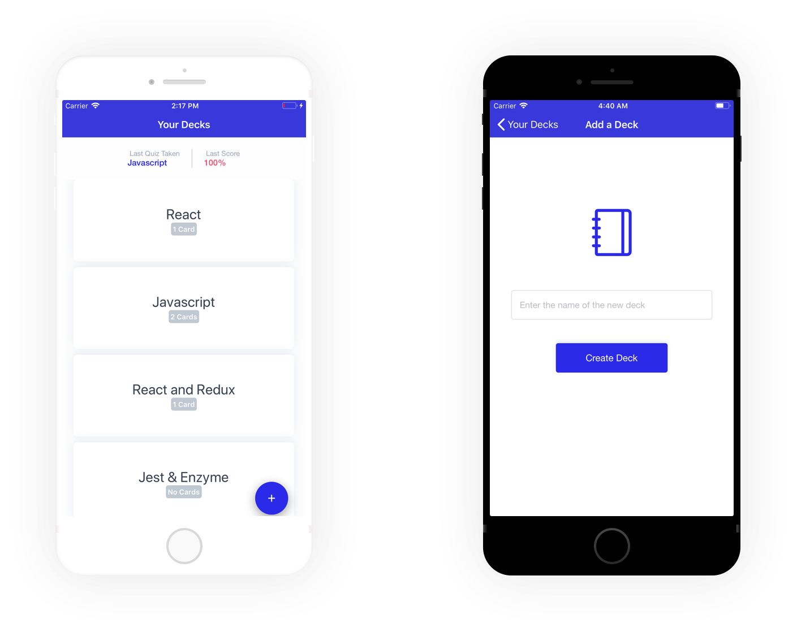

<br />

<h1 align="center">React Native Fitness</h1>
<div align="center"> A mobile <strong>iOS</strong> application that allows users to study collections of flashcards. Users can create different categories of flashcards called decks, add flashcards to those decks, then take quizzes on those decks. </div>

<br />

<div align="center">
  <a href="https://circleci.com/gh/romarioraffington/react-native-flashcards">
    
  </a>
</div>

<br />

<div align="center">
  
</div>

<br />

<div align="center">
  
</div>

## Getting Started

```sh
git clone https://github.com/romarioraffington/react-native-flashcards

cd react-native-flashcards/
yarn install
yarn start
```

## Commands 

### `yarn start`

Runs your app in development mode.

Open it in the [Expo app](https://expo.io) on your phone to view it. It will reload if you save edits to your files, and you will see build errors and logs in the terminal.

Sometimes you may need to reset or clear the React Native packager's cache. To do so, you can pass the `--reset-cache` flag to the start script:


#### `yarn test`

Runs the [jest](https://github.com/facebook/jest) test runner on your tests.

#### `yarn ios`

Like `yarn start`, but also attempts to open your app in the iOS Simulator if you're on a Mac and have it installed.


## License

[MIT](LICENSE)